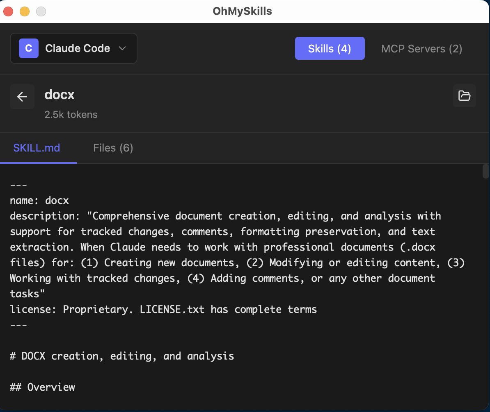

# OhMySkills

A minimal desktop GUI tool for managing Agent Skills and MCP (Model Context Protocol) Servers.

**Website**: [https://ohmys.dev](https://ohmys.dev) | **Download**: [GitHub Releases](https://github.com/stevensu1977/oh-my-skills/releases)

> Inspired by [Vercel's add-skill CLI](https://github.com/vercel-labs/skills) - this project provides a graphical interface for the same ecosystem.





## Features

- **Skills Management**
  - Search skills from [skills.sh](https://skills.sh) (powered by free API)
  - Install skills from URL, local file, or GitHub repository
  - View skill details: name, description, and SKILL.md content
  - Browse skill files with built-in file explorer (read-only)
  - Delete installed skills
  
- **MCP Servers Management**
  - Add/remove STDIO and HTTP servers
  - Toggle server enabled/disabled state
  - View server configuration details

- **Multi-Agent Support**
  - Claude Code (`~/.claude/skills/`, `~/.claude.json`)
  - Gemini CLI (`~/.gemini/skills/`, `~/.gemini/settings.json`)
  - Codex CLI (`~/.codex/skills/`)
  - OpenCode (`~/.config/opencode/skills/`)
  - Kiro CLI (`~/.kiro/skills/`, `~/.kiro/settings.json`)
  - Antigravity (`~/.gemini/antigravity/global_skills/`)
  - CodeBuddy (`~/.codebuddy/skills/`)
  - Cursor (`~/.cursor/skills/`)
  - Kimi CLI (`~/.kimi/skills/`)
  - Moltbot (`~/.moltbot/skills/`)
  - Qoder (`~/.qoder/skills/`)
  - Qwen Code (`~/.qwen/skills/`)
  - Zencoder (`~/.zencoder/skills/`)

- **System Tray**
  - Runs in background with tray icon
  - Quick access to settings and actions
  - Minimal resource usage

## Tech Stack

- **Frontend**: React + TypeScript + Vite
- **Backend**: Rust + Tauri 2.x
- **UI**: Dark theme, fixed 600x500 window

## Installation

### Prerequisites

- [Node.js](https://nodejs.org/) (v18+)
- [pnpm](https://pnpm.io/)
- [Rust](https://www.rust-lang.org/tools/install)

### Development

```bash
# Install dependencies
pnpm install

# Run in development mode
pnpm tauri dev

# Build for production
pnpm tauri build
```

## Usage

### Installing Skills

1. Click the "+" button in the Skills panel
2. Enter a skill source:
   - **URL**: Direct link to a `.zip` file or `SKILL.md`
   - **GitHub**: `github:owner/repo` or `https://github.com/owner/repo`
   - **Local**: Path to a local `.zip` file or directory

### Managing MCP Servers

1. Switch to the "MCP Servers" tab
2. Click "+" to add a new server
3. Choose transport type (STDIO or HTTP)
4. Fill in the required configuration

### Switching Agents

Use the dropdown in the header to switch between supported agents.

## Configuration Files

| Agent | Skills Directory | MCP Config |
|-------|-----------------|------------|
| Claude Code | `~/.claude/skills/` | `~/.claude.json` |
| Gemini CLI | `~/.gemini/skills/` | `~/.gemini/settings.json` |
| Codex CLI | `~/.codex/skills/` | - |
| OpenCode | `~/.config/opencode/skills/` | `~/.config/opencode/config.json` |
| Kiro CLI | `~/.kiro/skills/` | `~/.kiro/settings.json` |
| Antigravity | `~/.gemini/antigravity/global_skills/` | - |
| CodeBuddy | `~/.codebuddy/skills/` | - |
| Cursor | `~/.cursor/skills/` | - |
| Kimi CLI | `~/.kimi/skills/` | - |
| Moltbot | `~/.moltbot/skills/` | - |
| Qoder | `~/.qoder/skills/` | - |
| Qwen Code | `~/.qwen/skills/` | - |
| Zencoder | `~/.zencoder/skills/` | - |

## License

MIT

## Contributing

Contributions are welcome! Please feel free to submit a Pull Request.

