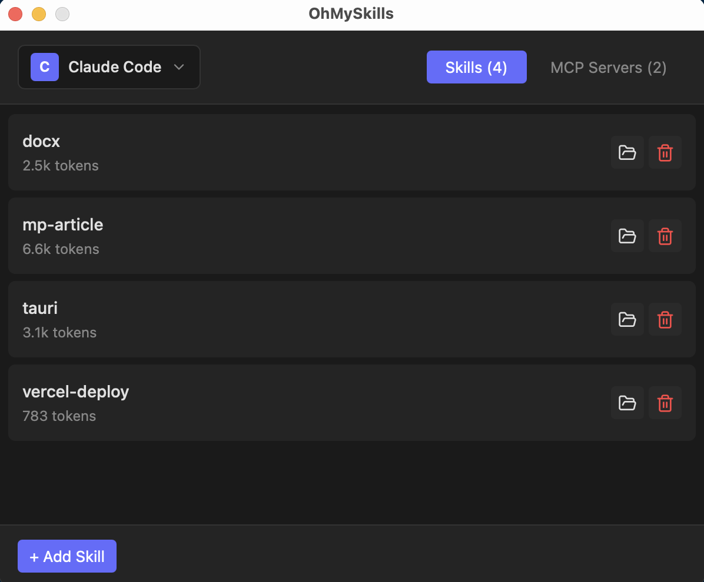
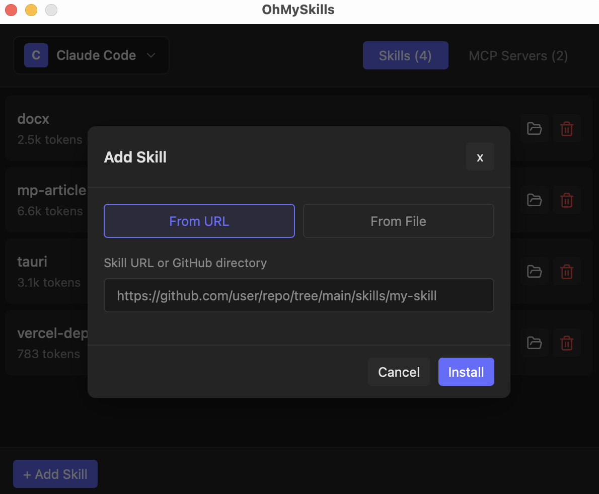
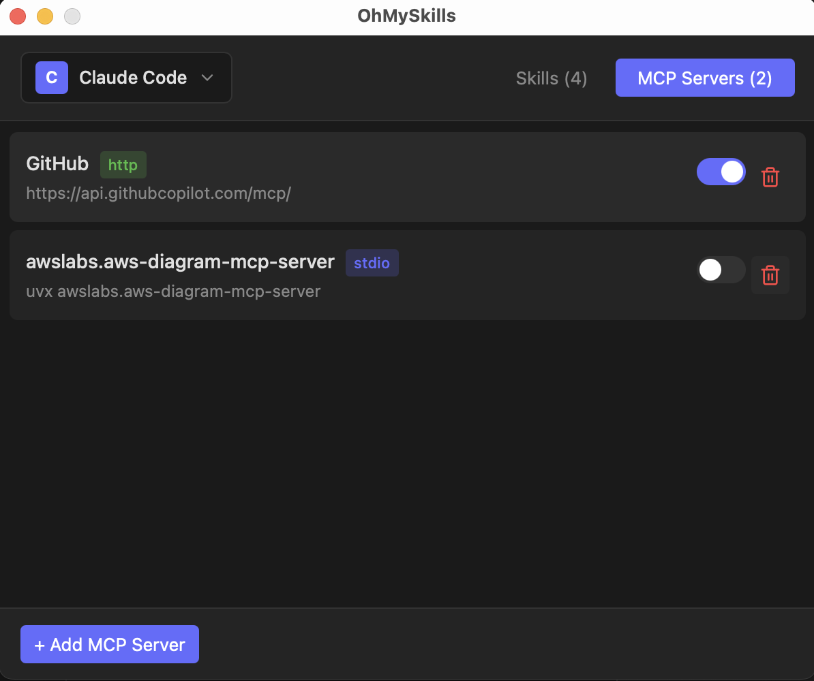
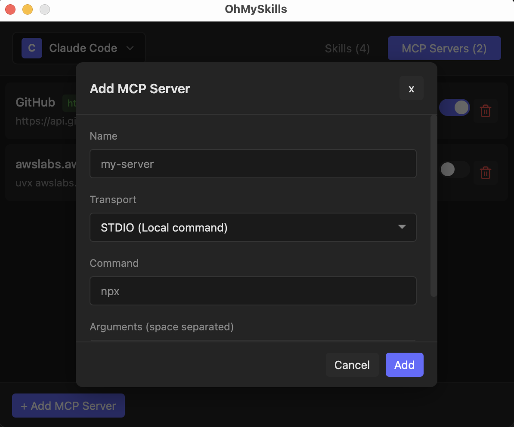

# OhMySkills

一个极简的桌面 GUI 工具，用于管理 Agent Skills 和 MCP（Model Context Protocol）服务器。

**官网**: [https://ohmys.dev](https://ohmys.dev) | **下载**: [GitHub Releases](https://github.com/stevensu1977/oh-my-skills/releases)

> 灵感来源于 [Vercel 的 add-skill CLI](https://github.com/vercel-labs/skills) - 本项目为同一生态系统提供图形化界面。






## 功能特性

- **Skills 管理**
  - 从 [skills.sh](https://skills.sh) 搜索 Skills（使用免费 API）
  - 从 URL、本地文件或 GitHub 仓库安装 Skills
  - 查看 SKILL.md 内容和 Token 数量
  - 删除已安装的 Skills
  
- **MCP 服务器管理**
  - 添加/删除 STDIO 和 HTTP 服务器
  - 切换服务器启用/禁用状态
  - 查看服务器配置详情

- **多 Agent 支持**
  - Claude Code (`~/.claude/skills/`, `~/.claude.json`)
  - Gemini CLI (`~/.gemini/skills/`, `~/.gemini/settings.json`)
  - Codex CLI (`~/.codex/skills/`)
  - OpenCode (`~/.config/opencode/skills/`)
  - Kiro CLI (`~/.kiro/skills/`, `~/.kiro/settings.json`)
  - Antigravity (`~/.gemini/antigravity/global_skills/`)
  - CodeBuddy (`~/.codebuddy/skills/`)
  - Cursor (`~/.cursor/skills/`)
  - Kimi CLI (`~/.kimi/skills/`)
  - Moltbot (`~/.moltbot/skills/`)
  - Qoder (`~/.qoder/skills/`)
  - Qwen Code (`~/.qwen/skills/`)
  - Zencoder (`~/.zencoder/skills/`)

- **系统托盘**
  - 后台运行，托盘图标常驻
  - 快速访问设置和操作
  - 资源占用极低

## 技术栈

- **前端**: React + TypeScript + Vite
- **后端**: Rust + Tauri 2.x
- **界面**: 深色主题，固定 600x500 窗口

## 安装

### 前置要求

- [Node.js](https://nodejs.org/) (v18+)
- [pnpm](https://pnpm.io/)
- [Rust](https://www.rust-lang.org/tools/install)

### 开发

```bash
# 安装依赖
pnpm install

# 开发模式运行
pnpm tauri dev

# 构建生产版本
pnpm tauri build
```

## 使用方法

### 安装 Skills

1. 点击 Skills 面板中的 "+" 按钮
2. 输入 Skill 来源：
   - **URL**: 直接链接到 `.zip` 文件或 `SKILL.md`
   - **GitHub**: `github:owner/repo` 或 `https://github.com/owner/repo`
   - **本地**: 本地 `.zip` 文件或目录的路径

### 管理 MCP 服务器

1. 切换到 "MCP Servers" 标签页
2. 点击 "+" 添加新服务器
3. 选择传输类型（STDIO 或 HTTP）
4. 填写所需配置

### 切换 Agent

使用顶部下拉菜单在已支持的 Agents 之间切换。

## 配置文件

| Agent | Skills 目录 | MCP 配置 |
|-------|------------|----------|
| Claude Code | `~/.claude/skills/` | `~/.claude.json` |
| Gemini CLI | `~/.gemini/skills/` | `~/.gemini/settings.json` |
| Codex CLI | `~/.codex/skills/` | - |
| OpenCode | `~/.config/opencode/skills/` | `~/.config/opencode/config.json` |
| Kiro CLI | `~/.kiro/skills/` | `~/.kiro/settings.json` |
| Antigravity | `~/.gemini/antigravity/global_skills/` | - |
| CodeBuddy | `~/.codebuddy/skills/` | - |
| Cursor | `~/.cursor/skills/` | - |
| Kimi CLI | `~/.kimi/skills/` | - |
| Moltbot | `~/.moltbot/skills/` | - |
| Qoder | `~/.qoder/skills/` | - |
| Qwen Code | `~/.qwen/skills/` | - |
| Zencoder | `~/.zencoder/skills/` | - |

## 许可证

MIT

## 贡献

欢迎贡献代码！请随时提交 Pull Request。

